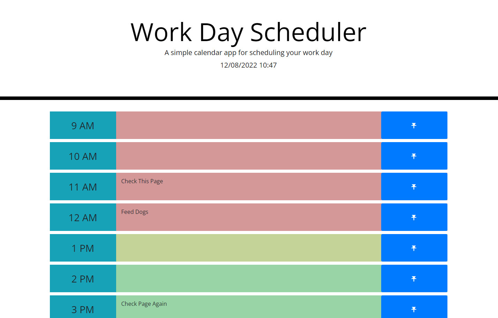

# Work Day Scheduler

https://palminski.github.io/p-5-schedule-rabit/

## Description
Simply click on an empy space on one of the time cards and it will turn into a text box where you can enter whatever task is due/needs to be done durring or after that time. If you want to save it to local storage all you need to do is click on the pin symbol to the right. The tasks are also all color coded and will display as red if they are before the current time, yellow if they are on the current hour, or green if they occure after the current time. The task list will update every minute to change the time displayed at the top of the screen and to update the colors of the tasks.

## How it's made
 a for loop will run 9 times creating each timecard element required to build the page. Each time the p element is being made the program will check an array to see if there is any text that needs to be inserted into it. otherwise it will begin blank. 
 When the save button (or Pin button) is clickd, the text on that card will be added to the savedtasks array at a position determined by a data element on the time block that will match up with the the order it is made in. this is then saved to local storage in order to be loaded back when the page loads.

 ## note(s)
When I got the doc the css was in the root folder with the index, so I opted to leave it there